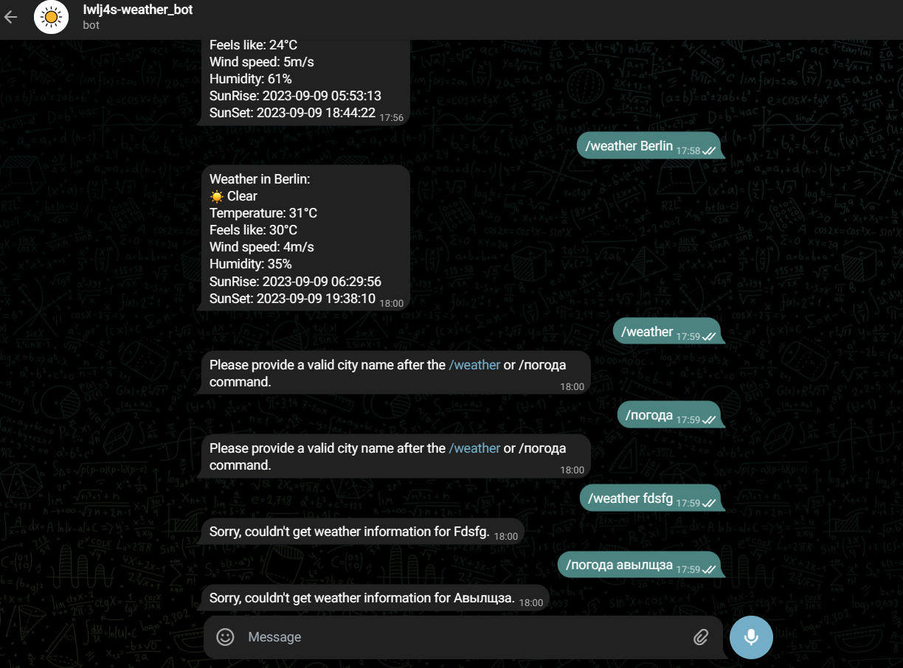

<H1 id="up" align="center" > Telegram Weather Bot</H1>

  
Table of Contents

  <ol >
    <li >
      <a href="#info">About The Project</a>
      <ul>
        <li><a href="#build_with">Build With</a></li>
      </ul>
    </li>
    <li><a href="#illustration">Illustration</a></li>
    <li><a href="#install">Usage</a></li>
  </ol>

> ***For now ---bot is not connected to the hosting--- , if I connect it, information about this will be here***

<H2 id="info"> General Info </H2>
A regular telegram weather bot. I think it can be improved

Again, I hope I can use this project in college

<H3 id="build_with"> Build With: </H3>

* <a href="https://aiogram.dev/">Aiogram </a>
* <a href="https://openweathermap.org/">Open Weather Map</a>
* <a href="https://telegram.me/BotFather">Bot Father</a>

<H2 id="illustration"> Illustration </H2>

<H2 id="install"> Usage </H2>

> ***For now ---bot is not connected to hosting--- if I connect it, information about this will be at the top***

If You want try him : https://t.me/Iwlj4s_weather_bot

